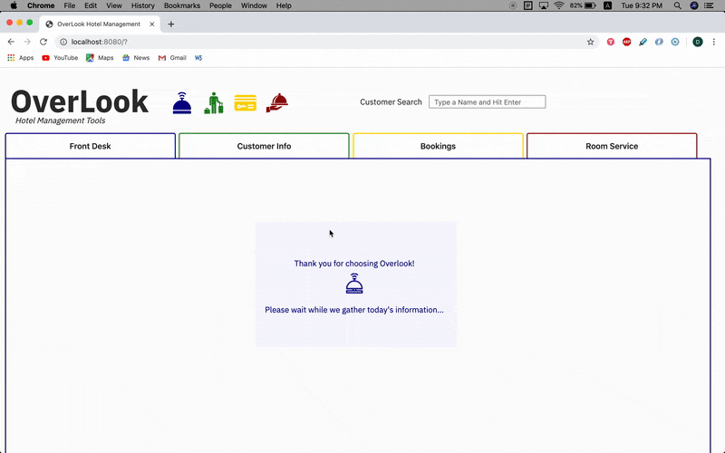

# Overlook 

##### This project presents a model of software to be used by hotel staff to handle guest intake and conduct basic account updates like making bookings and placing room service orders. The interface reflects the straight-forward style of those commonly available in the workplace, and is tabbable and displayed in high-contrast colors to enhance accessibility.

### Tools/Libraries used... 

- jQuery
- SASS/scss
- Fetch API
- Mocha & Chai w/ spies
- Webpack

### Screenshots/Links



### Installation Steps

- Clone the repo to your local machine

- Install the required dependencies:

```bash 
npm install
```
- In the command line:

```bash
npm start
```

- Look for the local server address in the output, which will look something like: 

```bash
Project is running at http://localhost:8080/
```

- Go to `http://localhost:8080/` in your browser to view the site
